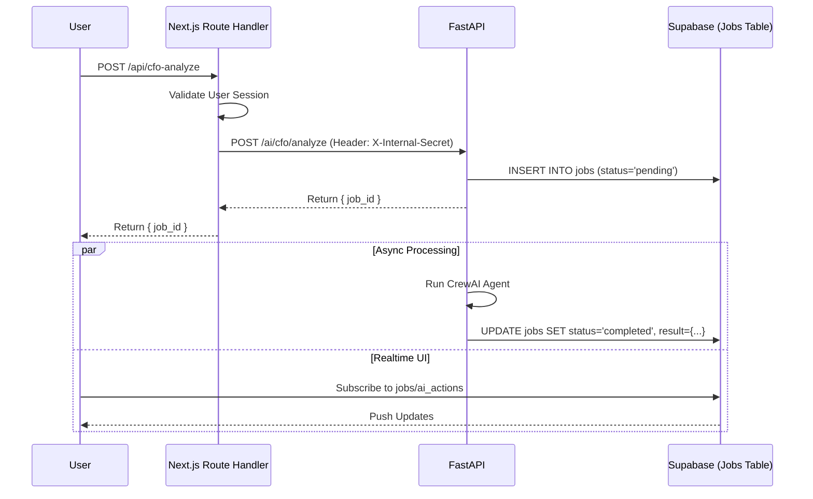

# ⚙️ Backend Architecture

## Overview

KyrieOS uses a **Serverless** architecture powered by **Supabase**. We leverage
Next.js Server Actions as the primary API layer.

---

## 🛡️ Database & Security

### Row Level Security (RLS)

- **Default:** All tables have RLS enabled.
- **Policies:**
  - `workspaces`: View/Edit if `created_by = auth.uid()` OR `exists in members`.
  - `invites`: Controlled via RPCs for secure token access.

### RPC Functions (Remote Procedure Calls)

Used for operations requiring elevated privileges or atomic transactions that
RLS makes difficult.

- `get_invite_by_token`: `SECURITY DEFINER` function to validate invites without
  public table access.
- `redeem_invite`: Atomic transaction (Insert Member + Delete Invite).

---

## ⚡ Server Actions Pattern

We use **Next.js Server Actions** (`'use server'`) located in
`src/app/dashboard/actions.ts`.

### conventions

1. **Input Validation:** Sanitize FormData/JSON before database calls.
2. **Auth Check:** Always verify `supabase.auth.getUser()` at the start of the
   action.
3. **Error Handling:** Return `{ message: string }` objects for UI toasts.
4. **Revalidation:** Use `revalidatePath()` to refresh Server Components after
   mutations.

### Example

```typescript
export async function createThing(formData: FormData) {
  const supabase = createClient()
  
  // 1. Auth Guard
  const { data: { user } } = await supabase.auth.getUser()
  if (!user) throw new Error('Unauthorized')

  // 2. Logic
  const { error } = await supabase.from('things').insert(...)
  
  // 3. Revalidate
  revalidatePath('/dashboard')
}
```

---

## 🔄 Type System

- **Source of Truth:** `src/types/supabase.ts` (Generated from Database Schema).
- **Workflow:**
  1. Change DB Schema (Supabase Dashboard).
  2. Run MCP Tool `generate_typescript_types` (or CLI).
  3. Types update automatically across the app.

---

## 🧠 Intelligence Engine Architecture (New)

Added in Phase 11, the Intelligence Engine handles heavy AI workloads
asynchronously.

### 1. Hybrid Architecture

- **Next.js (Frontend/BFF):** Handles UI, Auth, and "Triggering" jobs.
- **FastAPI (Microservice):** Runs CrewAI agents (Python).
  - **v1.1 Update:** Now uses **Groq (Llama-3.3-70b)** for high-speed inference.
  - **Traceability:** All actions linked via `original_job_id` metadata.
- **Supabase (Shared State):** Acts as the "Glue" between Next.js and Python.
  - Next.js writes to `contracts`/`worklogs`.
  - Python reads from Supabase.
  - Python writes results to `jobs` and `ai_actions`.
  - Next.js reads results via Realtime Subscription.

### 2. Secure Bridge Pattern

Direct communication between Next.js Server Side and FastAPI is protected:



### 3. Fail Fast & Persistence

- **Stateful Jobs:** We moved from in-memory dicts to a `jobs` table to prevent
  data loss on container restarts (Error 500 fix).
- **Environment Validation:** Both services crash at startup if secrets are
  missing, preventing runtime null errors.
