# 🔐 Authentication & Invite Flow

## Visão Geral

O KyrieOS suporta autenticação híbrida via Email/Password e OAuth (Google),
integrado com um sistema robusto de convites para onboarding de novos membros em
Workspaces.

## 1. Google OAuth

Implementado via Supabase Auth Helpers.

- **Provider:** Google
- **Fluxo:** Implicit Grant / PKCE
- **Redirecionamento:**
  - Login: `/auth/callback` -> `/dashboard`
  - Invite: `/login?next=/invite/[token]` -> `/invite/[token]`

> **Nota:** O Google OAuth deve estar configurado no painel do Supabase com as
> Redirect URIs corretas (`/auth/callback`).

## 2. Secure Invite Flow (Fluxo de Convite Seguro)

O fluxo de convite é desenhado para ser seguro, atômico e amigável.

### A. Criação (Admin/God Mode)

1. Admin acessa Modal de Convite.
2. Insere Email e Role.
3. **Server Action `createInviteAction`:**
   - Gera Token `crypto.randomUUID()`.
   - Insere na tabela `invites` (RLS garante que apenas Admins do workspace
     criem).
   - Retorna URL do convite: `https://app.kyrieos.com/invite/[token]`.

### B. Acesso (Convidado)

1. Usuário clica no link.
2. **Page `/invite/[token]`:**
   - Verifica se usuário está logado.
   - Se **Não Logado**: Redireciona para `/login?next=...` ou mostra botão de
     Login.
   - Se **Logado**: Chama Server Action de aceitação.

### C. Aceitação (Server-Side)

1. **Action `acceptInviteAction`** é invocada.
2. Chama RPC `get_invite_by_token(token)`:
   - Valida token no banco (Security Definer).
3. Chama RPC `redeem_invite(token, user_id)`:
   - **Transaction Start**
   - Verifica convite novamente.
   - `INSERT INTO workspace_members (user_id, workspace_id, role)`.
   - `DELETE FROM invites WHERE token = ...`.
   - **Transaction Commit**
4. Retorna sucesso e `workspaceSlug` para redirecionamento.

---

## Diagrama de Sequência (Mental Model)

```mermaid
sequenceDiagram
    participant User
    participant Page (/invite/token)
    participant Action (acceptInvite)
    participant DB (RPC functions)

    User->>Page: Acessa Link
    Page->>Page: Check Auth State
    
    rect rgb(20, 20, 20)
        Note right of Page: Se não logado
        Page->>User: Exibe/Força Login
    end

    User->>Page: Clica "Aceitar"
    Page->>Action: acceptInviteAction(token)
    Action->>DB: rpc.get_invite_by_token()
    DB-->>Action: Invite Data (Valid)
    Action->>DB: rpc.redeem_invite()
    DB-->>Action: Success + WorkspaceSlug
    Action-->>Page: Success
    Page->>User: Redirect to /dashboard/[slug]
```

